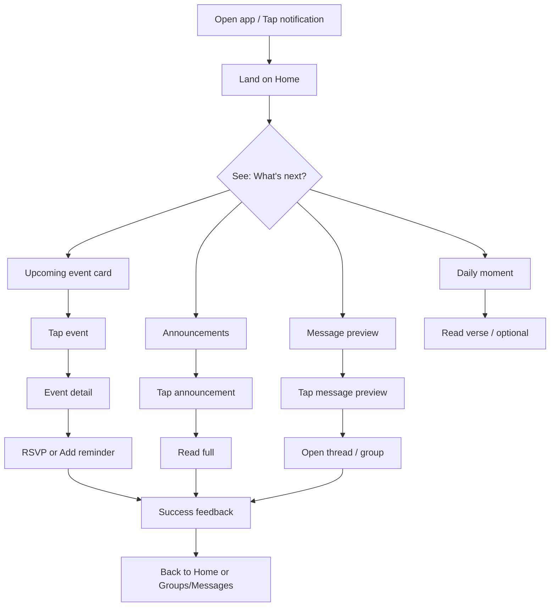
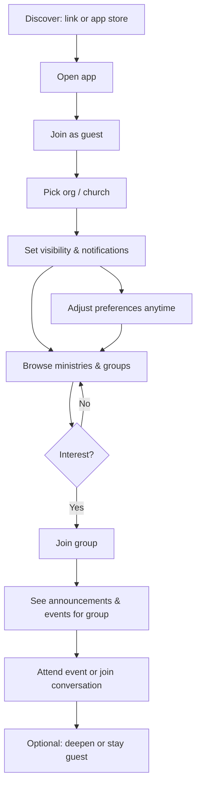
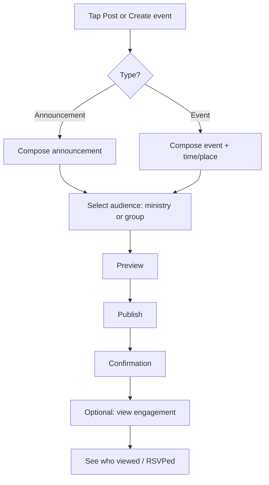
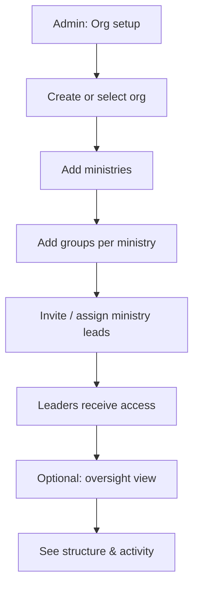

> **As-built (2026-03-24):** Visual direction in the live app follows tokenized “Calm & Glass” / spacious layouts as implemented; this spec remains the historical UX baseline. See `docs/as-built-snapshot.md`.

# UX Design Specification p28-v2

**Author:** Billy
**Date:** 2026-02-11

---

## Executive Summary

### Project Vision

p28-v2 is an online-first, connection-first app serving as the primary digital home for church life—one place for members, ministry leads, and admins to connect, receive events and announcements, and participate in groups and messaging. Success looks like users saying "This is a modern Christian's essential tool." The product is mobile-first (React Native/Expo, iOS + Android), with web as a possible future surface.

### Target Users

- **Members (e.g. Billy):** Church members in multiple ministries; need one app for church life instead of juggling Bible app, Zoom, and Discord.
- **Ministry Leads (e.g. Annie):** Lead young adult/youth or other ministries; need to manage groups, post announcements/events, reach the right people, and see who's engaged.
- **Admins:** Church leaders who set org structure, invite ministry leads, and oversee operations—not day-to-day content.
- **Seekers/Guests:** People exploring faith or a church; need low barrier, control over visibility and notifications, and gradual deepening.

### Key Design Challenges

- **Multi-role coherence:** Member, ministry lead, admin, and seeker need distinct yet coherent experiences in one app.
- **Trust and privacy:** Spiritual and relational context requires careful handling of visibility, consent, and safe spaces.
- **Connection over utility:** The app must feel like belonging and connection, not another productivity tool.
- **Mobile-first, content-rich:** Home, messaging, events, announcements, and groups must work well on small screens.
- **Multi-language (EN/KR/KH):** Layout and navigation must support multiple languages and scripts.

### Design Opportunities

- **Clear Home experience:** A focused Home with "what's next," daily moment, announcements, and message preview as the natural starting point.
- **Targeted communication:** Notifications and broadcasts by ministry/group to improve relevance and engagement.
- **Low-barrier guest mode:** Explorers can browse, join selectively, and control notifications without pressure.
- **Role-appropriate surfaces:** Different "command centers" per role so each audience sees the right tools and information.
- **Conversation-centric patterns:** Messaging and group discussions as central—design patterns that emphasize connection over transactional use.

## Core User Experience

### Defining Experience

**For members:** The core action is *open the app and immediately see what matters*—upcoming events, announcements, and recent messages—without hunting across multiple apps. The primary loop: open Home → see what's next → engage (view, RSVP, reply).

**For leaders:** The core action is *reach the right people*—post announcements and events, target by ministry/group, and see who's engaged. The primary loop: create content → target audience → see engagement.

### Platform Strategy

- **Mobile-first:** iOS and Android via React Native/Expo; single codebase.
- **Touch-first:** Primary interaction is touch; tap, swipe, pull-to-refresh.
- **Online-only (MVP):** No offline mode; all core flows assume connectivity.
- **Push essential:** Push for events, announcements, and messaging—critical for timely connection.
- **Web:** Out of scope for MVP; architecture should not block future web client.

### Effortless Interactions

- **Open app → instant context:** Home surfaces "what's next," announcements, and message preview in one glance—no hunting.
- **Joining a group:** Browse → join with minimal friction.
- **Notification relevance:** Targeting by ministry/group so users get what matters, not noise.
- **Guest exploration:** Low-barrier browse and join with clear control over visibility and notifications.
- **Role switching:** Leaders move from "member" view to "leader" view without getting lost.

### Critical Success Moments

- **Member (Billy):** Realizing he hasn't opened Zoom or Discord for church in days—everything he needs is in one place.
- **Leader (Annie):** Sending a targeted event reminder and watching RSVPs and messages pick up—"I can't live without this."
- **Seeker:** Attending an event or joining a conversation because they chose it—no spam, no pressure.
- **Admin:** Seeing the org structured, leaders active, and the app as the primary channel for church life.

### Experience Principles

1. **Connection first** — Design for belonging, not task completion.
2. **One place** — One app for church life; eliminate the juggle.
3. **Effortless loop** — Opening the app answers "what's next?" instantly.
4. **Role-appropriate** — Each role sees the right information and tools.
5. **Relevant over noisy** — Targeted communication over broadcast spam.
6. **Safe to explore** — Guests can browse and join with clear boundaries.

## Desired Emotional Response

### Primary Emotional Goals

- **Belonging** — Users feel part of something, not isolated.
- **In the loop** — Users feel informed and included without hunting.
- **Trust** — Users feel safe in spiritual and relational spaces.
- **Empowered** — Leaders feel in control; guests feel in control of their experience.

### Emotional Journey Mapping

| Stage | Desired Feeling |
|-------|-----------------|
| **Discovery** | Curious, welcomed—low pressure |
| **Onboarding** | In control—visibility and notifications are clear |
| **Core use** | Connected, informed, part of something |
| **After task** | Accomplished—not overwhelmed |
| **Return** | Familiar—"this is my place" |

### Micro-Emotions

- **Belonging vs. isolation** — Primary for members and seekers.
- **Trust vs. skepticism** — Critical for spiritual and relational context.
- **Confidence vs. confusion** — Clear hierarchy and flows so users know where they are.
- **Calm vs. overwhelmed** — Relevant notifications, not noise.
- **Control vs. powerless** — Guests control what they see and receive.

### Design Implications

- **Belonging** → Group presence, avatars, activity cues, warm copy and visuals.
- **In the loop** → Home that answers "what's next"; targeted notifications.
- **Trust** → Clear visibility rules, privacy controls, conduct expectations.
- **Control** → Granular preferences for guests; role-appropriate surfaces for leaders.
- **Calm** → Scannable layout, chunked content, opt-in over constant pings.

### Emotional Design Principles

1. **Warm, not cold** — Tone, visuals, and feedback feel human and welcoming.
2. **Safe, not exposed** — Clear privacy and visibility expectations.
3. **Connected, not isolated** — Signals of community presence and activity.
4. **In control, not overwhelmed** — Users set boundaries and preferences.
5. **Familiar, not alienating** — Patterns and flows that feel natural, not strange.

## UX Pattern Analysis & Inspiration

### Inspiring Products Analysis

**Discord** — Community and belonging: Channels and servers with clear hierarchy; low-friction join via invite; strong group identity (avatars, roles, activity); real-time messaging and presence; notification controls by server/channel.

**Slack** — Workspace structure and relevance: Workspace → channels → DMs; inbox-style unread/mentions; search and filters; targeted notifications by channel; clean hierarchy that scales.

**WhatsApp** — Messaging and groups: Simple group chat and DMs; groups with clear members and admins; push delivery and read receipts; familiar patterns; low friction for international users.

**YouVersion / Bible apps** — Daily habit and content: "Daily verse" habit trigger; optional push reminders; reading plans and scannable content; calm, focused UI.

**Calendar / Event apps (e.g. Google Calendar, Eventbrite)** — Events and RSVPs: Clear event cards; RSVP and reminders; "what's next" framing; calendar integration.

### Transferable UX Patterns

| Pattern | Source | Application to p28-v2 |
|---------|--------|------------------------|
| Hierarchical navigation | Discord, Slack | Org → Ministry → Group |
| Channel/group tabs | Discord, Slack | Groups as primary surfaces |
| Home/feed with "what's next" | Calendar apps, Bible apps | Home with events, announcements, message preview |
| Targeted notifications | Slack, Discord | Notifications by ministry/group |
| Guest/lurk mode | Discord | Seeker mode with limited visibility |
| Daily moment | Bible apps | Optional verse/devotional on Home |
| Presence and avatars | Discord, Slack | Group activity and belonging cues |
| Simple group chat | WhatsApp | Messaging in groups and DMs |

### Anti-Patterns to Avoid

- **Notification overload** — Broadcast spam; untargeted blasts (like old church email lists).
- **Fragmented experience** — Multiple apps; users juggling tools.
- **Opaque visibility** — Users unsure who sees their profile or activity.
- **Heavy onboarding** — Long forms or steps before value.
- **Utility-first UI** — Feels like a tool, not a place for belonging.
- **Unclear hierarchy** — Flat or confusing org/ministry/group structure.
- **Passive feed** — Endless scroll with no clear engagement path.

### Design Inspiration Strategy

**Adopt:** Org → Ministry → Group hierarchy (Slack/Discord); targeted notifications by audience (Slack); Home with "what's next" (Calendar + Bible app); guest/lurk mode (Discord); presence and avatars for belonging (Discord, Slack).

**Adapt:** Daily moment—simple and optional, not intrusive (Bible apps); event cards and RSVP—mobile-first (Calendar apps); messaging—ministry-aware threading (WhatsApp + Slack).

**Avoid:** Server discovery/public listing (not church context); gaming/casual aesthetic (keep warm and calm); complex channel permissions (simplify for ministry leads).

## Design System Foundation

### 1.1 Design System Choice

**Custom design system** — Build our own UI components on top of React Native primitives (View, Text, TouchableOpacity, etc.) with no third-party component library as the base.

### Rationale for Selection

- **Full control:** Every component can be tuned for the warm, belonging-focused church experience without fighting a library's defaults.
- **Brand uniqueness:** No "Material" or generic look; the app can feel distinctly p28-v2.
- **Purpose-built:** Components designed around our flows—Home, events, groups, messaging, ministry hierarchy.
- **No library lock-in:** We own the API and can evolve it with the product.
- **Multi-language and accessibility:** Typography, spacing, and interactions designed from the start for EN/KR/KH and WCAG 2.1 AA.

**Tradeoff:** Higher upfront design and implementation effort in exchange for a cohesive, on-brand experience.

### Implementation Approach

- **Design tokens first:** Define colors, typography scale, spacing, radius, and elevation in a single source of truth (e.g. theme object or design-tokens file).
- **Primitive layer:** Core building blocks (Button, Card, Input, List item, Avatar, Badge) built from RN primitives and tokens.
- **Component library:** Compose primitives into patterns (EventCard, GroupRow, MessageBubble, MinistryNav) used across the app.
- **Documentation:** Simple component catalog (names, props, usage) so the team uses components consistently.
- **Accessibility:** Build in touch targets, labels, and screen-reader support from the start; validate core flows against WCAG 2.1 AA.

### Customization Strategy

- **Colors:** Warm primary and neutrals; accent for CTAs; semantic colors for states (success, warning, error).
- **Typography:** Clear hierarchy; support system font scaling and EN/KR/KH.
- **Spacing and elevation:** Consistent scale (e.g. 4/8/16/24) and subtle depth where needed.
- **Components:** Start with the highest-impact screens (Home, groups, events, messaging) and grow the set as features expand.

## 2. Core User Experience

### 2.1 Defining Experience

**"Open the app and know what's next."**

The defining experience for members is opening the app and immediately seeing what matters—upcoming events, announcements, and recent messages—so they stay in the loop without opening other apps. For leaders it's **"Reach the right people"**—post once, target by ministry/group, see engagement. The member moment is the primary defining experience we're designing for.

### 2.2 User Mental Model

- **Current state:** Users juggle Bible app, Zoom, Discord; they expect church to live across tools.
- **Target state:** One app = church life; opening it answers "what's happening?" and "what do I need to do?"
- **Mental model:** "This is my church home"—like opening a familiar social or messaging app, not a utility.
- **Confusion risks:** Unclear org/ministry/group hierarchy; noisy notifications; cold or clinical UI.

### 2.3 Success Criteria

- Opening the app surfaces a clear "what's next" (event or highlight) within a couple of seconds.
- Home answers: what's next, what's new (announcements), what's active (messages)—without hunting.
- One–two taps from Home to RSVP or open a conversation.
- Leaders can post and target in a few steps and see that it reached the right people.
- Users describe the product as "the app I use for church" and "I don't need the others for this."

### 2.4 Novel UX Patterns

- **Mostly established:** Home/feed, event cards, group lists, targeted notifications are familiar (Slack, Discord, calendar apps).
- **Our twist:** Single product for church life (members + leaders + guests), ministry hierarchy as the structure, and emotional bar set to belonging and "in the loop" rather than productivity.
- **No new gesture or paradigm:** We combine known patterns in a clear, warm, church-first way.

### 2.5 Experience Mechanics

**Member — "Open and know what's next"**

1. **Initiation:** User opens app (or taps notification) → lands on Home (or deep link).
2. **Interaction:** Home shows next event, daily moment (optional), announcements, message preview; user scrolls/taps to see more or act.
3. **Feedback:** Content loads quickly; taps open event detail, announcement, or thread; RSVP/response confirms action.
4. **Completion:** User is informed and/or has acted; can leave or go to Groups/Messages; next open feels familiar.

**Leader — "Reach the right people"**

1. **Initiation:** Leader taps "Post" or "Create event" from a clear entry point.
2. **Interaction:** Composes content, selects audience (ministry/group), submits.
3. **Feedback:** Confirmation; optional view of who's engaged (e.g. views, RSVPs).
4. **Completion:** Message/event is live and targeted; leader can move on or check engagement.

## Visual Design Foundation

### Color System

- **Primary:** #2C7CB5 (soft blue) for primary actions and key UI—warm and inviting without feeling cold or corporate.
- **Complementary accent:** #C77B38 (warm amber/orange), opposite on the color wheel—use for secondary highlights, daily moment, or alternate CTAs so the palette stays cohesive.
- **Neutrals:** Soft grays for background and text; avoid pure black for a softer, human feel.
- **Accent:** Use primary or complementary (#C77B38) sparingly for CTAs and highlights.
- **Semantic:** Success, warning, error with clear meaning and sufficient contrast.
- **Contrast:** All text and interactive UI meet WCAG 2.1 AA (e.g. 4.5:1 for body text, 3:1 for large text).

### Typography System

- **Tone:** Friendly and clear; not corporate or cold.
- **Hierarchy:** Clear scale for headings (e.g. h1–h3), subheads, body, captions, and labels.
- **Scale:** Support system font scaling; minimum body size for readability; suitable for EN/KR/KH.
- **Pairing:** One primary typeface (or system stack) for consistency and performance; optional secondary for headings if brand evolves.

### Spacing & Layout Foundation

- **Base unit:** 4px or 8px; consistent scale (e.g. 4, 8, 12, 16, 24, 32) for padding, margins, and gaps.
- **Density:** Balanced—not cramped; enough whitespace for calm, scannable screens.
- **Touch targets:** Minimum 44pt for primary interactive elements (buttons, list rows, nav).
- **Grid:** Simple vertical rhythm and consistent horizontal padding; list and card layouts that adapt across screen sizes.

### Accessibility Considerations

- Color is not the only differentiator; use iconography and labels alongside color.
- Meet WCAG 2.1 AA for core flows (onboarding, Home, messaging, events).
- Support reduced motion preferences where applicable.
- Validate with screen reader and with all supported languages (EN/KR/KH).

## Design Direction Decision

### Design Directions Explored

Six visual directions are available in `_bmad-output/planning-artifacts/ux-design-directions.html`:

1. **Warm & Soft** — Soft neutrals (#faf8f5), rounded corners, primary #2C7CB5. Welcoming and approachable.
2. **Clear & Structured** — Strong hierarchy, section labels, primary #2C7CB5. Easy to scan.
3. **Compact & Efficient** — Tighter spacing, primary #2C7CB5. For users who prefer density.
4. **Spacious & Calm** — Generous whitespace, primary #2C7CB5. Calm and focused.
5. **Muted & Refined** — Muted palette, primary #2C7CB5 accent. Understated and refined.
6. **Primary + Complementary** — Primary #2C7CB5 with complementary accent #C77B38 (warm amber) for highlights.

### Chosen Direction

**Direction 1 — Warm & Soft** as the baseline. Aligns with emotional goals (warm, belonging), custom design system, and visual foundation. Primary #2C7CB5; complementary accent #C77B38 for secondary highlights where needed.

### Design Tokens (Warm & Soft baseline)

- **Background:** #faf8f5 (warm off-white)
- **Surface/cards:** #ffffff with subtle shadow; #e8eef5 for primary-tinted highlight (e.g. daily moment)
- **Primary:** #2C7CB5 (soft blue) for key actions and links
- **Complementary accent:** #C77B38 (warm amber) for secondary highlights
- **Text primary:** #3d2c29 (warm dark); text secondary: same with ~0.8 opacity
- **Radius:** 12px cards; 8px buttons/chips
- **Contrast:** Verify all text/surface combos meet WCAG 2.1 AA (4.5:1 body, 3:1 large)

### Design Rationale

- Warm & Soft supports "belonging" and "in the loop" without feeling cold or corporate.
- Primary #2C7CB5 and complementary #C77B38 give a cohesive, warm palette.
- The same clear hierarchy supports leaders' "reach the right people" flows; contrast and spacing are set with WCAG 2.1 AA and multi-language (EN/KR/KH) in mind.

### Implementation Approach

- Use the HTML showcase to validate with stakeholders; lock or adjust tokens (e.g. primary hue) in a single theme file if needed.
- Implement design tokens (colors, radius, spacing) to match chosen direction; build custom components (EventCard, DailyMoment, GroupRow) on top.
- After stakeholder review, lock the direction or combine elements from other directions as needed.

## User Journey Flows

### Member (Billy) — "Open and know what's next"

Member’s primary loop: open app → Home → see what’s next (event, daily moment, announcements, messages) → act (view, RSVP, reply) → leave or go deeper (Groups/Messages).

**Entry points:** App open, push (event reminder, new message, announcement). **Success:** User is informed and/or has acted in 1–2 taps from Home. **Recovery:** If content fails to load, show retry and cached "what's next" if available.

---

### Seeker / Guest — Explore with control

Guest flow: discover → join as guest → set visibility & notifications → browse ministries/groups → optionally join group(s) → attend event or conversation on their terms.

**Entry points:** Invite link, app store. **Success:** Guest attends or participates without feeling pressured. **Recovery:** Clear "Leave group" and preference controls; no dead ends.

---

### Ministry Lead (Annie) — "Reach the right people"

Leader flow: choose to post announcement or create event → compose → choose audience (ministry/group) → publish → optionally see engagement (views, RSVPs).

**Entry points:** Home or leader surface ("Post", "Create event"). **Success:** Content is targeted and published in a few steps; leader can see it reached the right people. **Recovery:** Save draft; clear validation (e.g. "Select audience") before publish.

---

### Admin — Set up org and leaders

Admin flow: create/select org → add ministries → add groups (per ministry) → invite/assign ministry leads → optional oversight.

**Entry points:** Admin entry (e.g. from role or onboarding). **Success:** Org structure is clear and leaders can run their ministries. **Recovery:** Edit/delete ministry or group; reassign leads with clear confirmation.

---

### Journey Patterns

- **Home as hub:** Member and guest value "what's next" on Home; leaders and admins have a clear entry (Post, Create event, Org setup) from their own surface or Home.
- **Progressive commitment:** Guest chooses org → preferences → browse → join group(s); no big upfront form.
- **Target then publish:** Leaders always select audience (ministry/group) before publishing; confirmation before send.
- **One primary action per screen:** Home focuses on "what's next"; post flow on compose → audience → publish; admin on structure steps.
- **Feedback on success:** RSVP/response confirmation; "Published" for leaders; "Saved" for admin changes.

### Flow Optimization Principles

- **Minimize steps to value:** Member sees "what's next" on first screen; guest can browse with minimal steps; leader can post in a short flow.
- **Low cognitive load:** Clear section labels (e.g. "What's next", "Announcements"); one main CTA per card; audience selector is explicit.
- **Clear feedback:** Loading and success states for RSVP, send, and save; errors with retry or back.
- **Delight / accomplishment:** Member: "I'm in the loop"; Guest: "I chose this"; Leader: "They got it"; Admin: "Structure is set."
- **Error recovery:** Retry for network; validation before submit; "Leave group" and preference controls for guests; draft or back for leaders.

## Component Strategy

### Design System Components

Custom design system primitives (from Design System Foundation):

- **Button** — Primary, secondary, text; tokens (primary #2C7CB5, radius, spacing).
- **Card** — Container with optional shadow/border for events, announcements, list rows.
- **Input** — Text field with label, validation state, a11y.
- **List item / Row** — Tap target, optional avatar, title, meta, chevron.
- **Avatar** — Profile image or initial; sizes (small, medium, large).
- **Badge** — Count or status (e.g. "3 new"); primary or complementary.
- **Typography** — Headings, body, caption, label from type scale.
- **Spacer / Divider** — Spacing scale for layout and separation.

### Custom Components

| Component | Purpose | Key content/actions | States |
|-----------|--------|----------------------|--------|
| **EventCard** | Show "what's next" and event detail | Title, time, place, RSVP / Add reminder | Default, loading, past |
| **DailyMomentCard** | Optional verse/devotional on Home | Verse ref, short text; optional "Read more" | Default, collapsed/expanded |
| **AnnouncementCard** | Announcement in feed or group | Title, snippet, author/date, "Read more" | Default, unread indicator |
| **MessagePreviewRow** | Message/thread preview on Home or list | Avatar(s), last message snippet, time, unread badge | Default, unread, muted |
| **GroupRow** | Ministry or group in lists/browse | Name, member count or "3 new", join/joined | Default, joined, loading |
| **MinistryNav** | Org → Ministry → Group hierarchy | Levels; selection state | Default, selected, expanded |
| **AudienceSelector** | Leader: pick ministry/group for post/event | List or chips; selection | Default, selected, validation |
| **ComposeCard** | Leader: create announcement or event | Title, body, audience, Publish | Default, draft, sending, success/error |
| **OrgStructureRow** | Admin: org/ministry/group in structure view | Name, type, edit/delete | Default, editing |

### Component Implementation Strategy

- **Tokens first:** All components consume one theme (colors, spacing, radius, type).
- **Primitives then patterns:** Build Button, Card, List item, Avatar, etc., then EventCard, GroupRow, etc. on top.
- **Accessibility:** 44pt touch targets; screen reader labels and roles; support font scaling (EN/KR/KH).
- **States:** Default, loading, disabled, error where relevant; clear success feedback.

### Implementation Roadmap

**Phase 1 — Core (Member "open and know what's next"):** EventCard, DailyMomentCard, AnnouncementCard, MessagePreviewRow; Home layout; primitives (Button, Card, List item, Avatar, Badge, Typography).

**Phase 2 — Groups and messaging:** GroupRow, MinistryNav; message list and thread UI; guest preference controls and "Leave group".

**Phase 3 — Leader and admin:** AudienceSelector, ComposeCard; leader engagement view; Admin OrgStructureRow and org/ministry/group CRUD flows.

## UX Consistency Patterns

### Button Hierarchy

- **Primary:** One main action per context (e.g. RSVP, Publish, Join). Primary color (#2C7CB5), full-width or prominent; 44pt min height.
- **Secondary:** Alternative or cancel (e.g. "Maybe", "Edit"). Outline or soft fill; same touch target.
- **Tertiary / text:** Low emphasis (e.g. "Read more", "Skip"). Text only, primary or neutral; 44pt tap area where tappable.
- **Destructive:** Leave group, delete, etc. Semantic error/destructive color; confirm before submit where appropriate.

### Feedback Patterns

- **Success:** Brief confirmation (e.g. "Saved", "Published", "RSVP sent") with check or toast; auto-dismiss or tap to dismiss.
- **Error:** Inline near field or banner at top; message + retry or fix path; avoid blocking whole screen when possible.
- **Loading:** Skeleton or spinner on the affected component (e.g. card, list); disable primary CTA and show "Sending…" or equivalent.
- **Validation:** Inline on blur/submit; one message per field; use semantic error color from tokens.

### Form Patterns

- **Labels:** Always visible (no placeholder-only); optional fields marked "(optional)".
- **Audience selector (leaders):** Single choice (ministry or group) via list or chips; required before Publish; clear "Select audience" state.
- **Compose (announcement/event):** Title + body; event adds date/time/place; draft saved on leave or background; Publish only after audience selected.
- **Guest preferences:** Toggles or checkboxes for visibility and notification types; "Save" or auto-save with brief confirmation.

### Navigation Patterns

- **Bottom nav (member/guest):** Home, Groups, Messages, Profile; active state = primary color; labels always visible.
- **Leader:** Same bottom nav plus clear entry to "Post" or "Create event" (FAB or nav item) opening compose flow.
- **Admin:** Entry to org structure from Groups tab (when user is admin); then hierarchy (Org → Ministry → Group) as list or stepper.
- **Back:** System back or explicit "Back" for flows (compose, event detail, thread); preserve scroll/state where possible.

### Additional Patterns

- **Empty states:** Short copy (e.g. "No events yet", "No messages") + one suggested action (e.g. "Browse groups", "Create event" for leaders); optional illustration or icon.
- **Loading states:** Skeleton cards on Home (event + announcement shapes); spinner or skeleton in lists; avoid full-screen spinner for in-context loads.
- **Modals / overlays:** Confirmations (e.g. Leave group, Delete); primary action right, secondary/cancel left; scrim tap = dismiss only when safe (e.g. cancel).
- **Pull-to-refresh:** On Home and list screens (groups, messages) where content can change; standard indicator.

## Responsive Design & Accessibility

### Responsive Strategy

- **MVP:** Mobile-only (phones). Single layout optimized for portrait; landscape supported with same content.
- **Phones:** Bottom nav, full-width cards, vertical scroll; consistent horizontal padding (e.g. 16–20px).
- **Tablets:** Same layout with larger touch targets and spacing; optional max content width for readability.
- **Web (later):** When added, use breakpoints (e.g. 768px, 1024px) for optional side nav or multi-column; core flows usable from 320px up.

### Breakpoint Strategy

- **In-app (React Native):** Use window dimensions; no pixel breakpoints. Theme spacing and 44pt min touch target; layout scales with screen size.
- **If/when web:** Mobile-first; base < 768px; tablet 768–1023px; desktop 1024px+.

### Accessibility Strategy

- **Target:** WCAG 2.1 Level AA for core flows (onboarding, Home, messaging, events) per PRD.
- **Contrast:** 4.5:1 normal text, 3:1 large text and UI; verify primary #2C7CB5 and complementary #C77B38 on backgrounds.
- **Touch targets:** Minimum 44×44pt for interactive elements.
- **Screen reader:** Descriptive labels for all interactive elements; headings and list structure; live regions for success/error.
- **Font scaling:** Support system font scaling (EN/KR/KH); no clipping; reflow as needed.
- **Reduced motion:** Respect system "reduce motion" preference where applicable.
- **Focus (web):** Visible focus indicator; logical tab order; skip to main content where relevant.

### Testing Strategy

- **Devices:** Multiple phone sizes and at least one tablet; iOS and Android.
- **Screen readers:** VoiceOver (iOS) and TalkBack (Android) on core flows (Home, RSVP, thread, leader publish, guest join).
- **Contrast:** Automated check on primary, complementary, and text; fix failures.
- **Language:** Verify EN/KR/KH layout and truncation; test with font scaling on.
- **Manual:** Keyboard-only when web exists; optional color-blindness simulation.

### Implementation Guidelines

- **Layout:** Theme spacing and flex/percentage; avoid hard-coded small touch targets.
- **Touch targets:** minHeight/minWidth 44pt (or hitSlop) for tappable elements.
- **Labels:** accessibilityLabel (and accessibilityHint when helpful) for buttons, cards, list items, nav.
- **Roles:** Correct roles (button, link, heading, list) for structure.
- **Dynamic updates:** Live region / announcement for success and error messages.
- **Theme:** Single source for colors and spacing; verify contrast when adding new surfaces or text.
